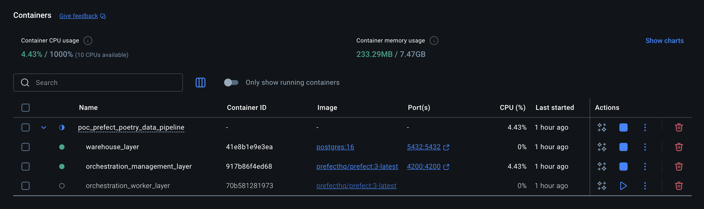
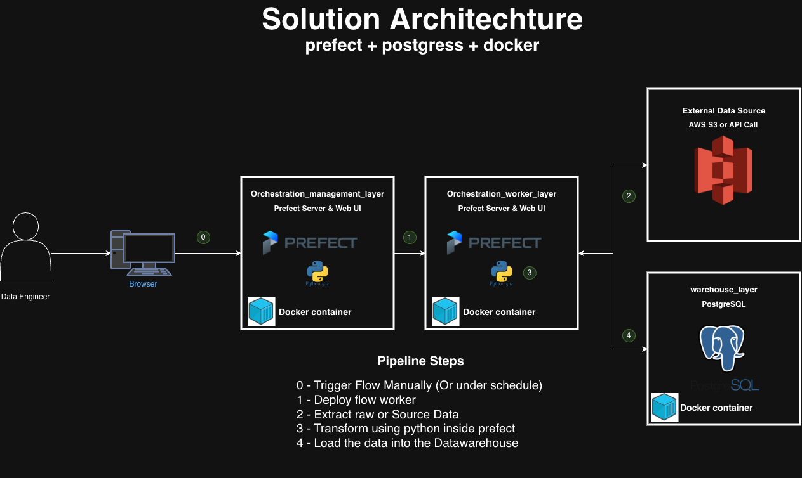

# 🚀 ETL Pipeline Playground — Assessment Edition  
#### Tech stack: Poetry + Prefect + Boto 3 + AWS CLI + S3 + Postgres + Docker VM's + macOS M Series Silicon)
#### Note: Take this project as an onboarding process in your new data engineer role or to surprise a tech interviewer for a job application.

> _“Because nothing says ‘hire me’ like a modular, observable, containerised ETL that refuses to break under pressure.”_

Welcome to your **mini production data platform in a box**, built to showcase the skills required for the ETL assessment:

- Extract structured/unstructured data from **AWS S3**
- Transform & enrich it using **clean, modular Python** prefects new version of Apache Airflow midnset. (runing inside docker)
- Load results into **Postgres** (running inside Docker)
- Wrap everything with **Prefect flows & tasks**  
- Ship the whole thing as **containerised, reproducible infra** to reproduce on the cloud.
- Demonstrate **real-world engineering patterns** in under 2 hours  

This repository is designed to be easy to review during the follow-up session. 

Reviewers can quickly see:

✔ Architecture & data flow  
✔ Modular Python design (tasks, utils, config)  
✔ Orchestration via Prefect flows & tasks  
✔ Docker/Postgres setup  
✔ Your platform-engineering thought process  

---

## 🧠 How to Run This? (Poetry Edition)

Before cloning the repo or diving into the Prefect world, make sure you have:

1. **Homebrew** (recommended on macOS)
2. **Git**
3. **Python 3.12.x**
4. **Docker Desktop** (For VMs config management)
5. **Poetry** (python project VM management)
6. **Prefect** (Orchestration layer)
7. **AWS CLI** (configured with credentials that can read the test S3 bucket and store credentials using AWS KMS)

If you’re on an Apple Silicon (M1/M2/M3/M4) Mac, everything here is tested with that in mind.

---

## ⚙️ 0. Installing Prerequisites (macOS, M-Series Friendly)

If you already have these, you can skip to the next section.

```bash
# Homebrew
/bin/bash -c "$(curl -fsSL https://raw.githubusercontent.com/Homebrew/install/HEAD/install.sh)"

# Python 3.12 (via pyenv or directly, your call)
brew install python@3.12

# Git & Docker
brew install git
brew install --cask docker

# Poetry (official recommended installer)
brew install poetry

# AWS CLI
brew install awscli
aws configure  # (Optional) set up your AWS creds manually

# Prefect (installed in the project venv later via Poetry)
```

Make sure Docker Desktop is up and running before continuing.

## 📦 1. Clone the Repo

```bash
git clone https://github.com/jrengif/poc_prefect_poetry_data_pipeline.git
cd po_prefect_poetry_data_pipelines
```


## 🧩 2. Create & Activate the Python Environment

Everything is managed with Poetry.

```bash
poetry env use 3.12

# Install dependencies (including Prefect, SQLAlchemy/psycopg2, boto3, etc.)
poetry install

# Activate the virtual environment
eval $(poetry env activate)
```

## 🔐 3. Configuration & Environment Variables

Configuration is driven via environment variables.

You can use a local .env file in the project root; this repo assumes something like:

Take this .env file and update it with the specific data for little Proof of Concept

```bash
# .env

# AWS/S3
AWS_ACCESS_KEY_ID=your_access_key_id
AWS_SECRET_ACCESS_KEY=your_secret_access_key
AWS_DEFAULT_REGION=eu-west-1
S3_INPUT_BUCKET=your-input-bucket
S3_INPUT_PREFIX=data/raw/
S3_OUTPUT_PREFIX=data/processed/

# Postgres (Docker) – master credentials (local dev only!)
POSTGRES_USER=admin
POSTGRES_PASSWORD=admin_password
POSTGRES_DB=warehouse_db
POSTGRES_HOST=localhost
POSTGRES_PORT=5432

# separate ETL user app/flows to connect with more limited permissions.
ETL_DB_USER=etl_user
ETL_DB_PASSWORD=etl_password

```

## 🐳 4. Start VMs architechture with Docker - Orchestration and storaging layer

A simple docker-compose file is included to run Postgres and prefect in a container. From the project root:


```bash
# From the project root (where docker-compose.yml lives), run:
docker compose up -d

# (Optional) If you’ve changed images or Docker-related config and want to rebuild:
docker compose up -d --build
```

After runing that you could check on docker desktop and the the containers running isolated.




Typical docker-compose.yml service for Postgres looks like, trying to follow best practices using .env file:

```bash
services:
  db:
    image: postgres:16
    environment:
      POSTGRES_USER: ${POSTGRES_USER:-etl_user}
      POSTGRES_PASSWORD: ${POSTGRES_PASSWORD:-etl_password}
      POSTGRES_DB: ${POSTGRES_DB:-etl_db}
    ports:
      - "5432:5432"
    healthcheck:
      test: ["CMD-SHELL", "pg_isready -U $$POSTGRES_USER"]
      interval: 5s
      timeout: 5s
      retries: 5
```


You can verify if containers are up:

```bash
docker ps

# For stopping the container you can run
docker compose stop

# For starting again
docker compose start
```

### 🚀 What `docker compose up` Does

When you run `docker compose up`, Docker Compose will:

1. 📄 **Read `docker-compose.yml`**
   - 🔎 Finds your services: `warehouse_layer` and `orchestration layer`.
   - ⚙️ Loads volumes, environment variables, ports, healthchecks, etc.

2. 🌐 **Create the Docker network**
   - 🧩 Places all services on the same internal network.
   - 🔗 This is why `prefect` can reach Postgres using `POSTGRES_HOST=db` (the service name).

3. 🧱 **Create and start the containers**
   - 📥 Pulls the required images (`postgres:16`, `prefecthq/prefect:3-latest`) if you don’t have them locally.
   - 📦 Creates containers:
     - 🗄️ `warehouse_layer` for the PostgreSQL database
     - 🧠 `orchestration_layer` for Prefect
   - 💾 Attaches the named volume `postgres_data` to Postgres for persistent storage.

4. 📡 **Expose ports to your host machine**
   - 🐘 Exposes Postgres on `localhost:${POSTGRES_PORT:-5432}`.
   - 📊 Exposes the Prefect UI on `http://localhost:4200`.

5. 🧾 **(Foreground mode) Stream logs in your terminal**
   - 🖥️ If you omit `-d`, you’ll see logs from both `db` and `prefect` in your terminal.


## 🧱 5. Checking that everything is up and running as expected

For the Prefect part lets open the URL and you could see the APP runing and being accesible from the local host

http://localhost:4200/dashboard


For postgress use DBeaver to acces using admin priviliges as DBM

https://dbeaver.io/download/

After testing on debeaver filling the fields using the ones provided in the .env file


## 📂 Project Structure & architechture overview Let's do a break!

This repository is a small, modular, production-like data platform built around two core ideas:

1. Orchestration with Prefect

2. A dedicated Postgres “warehouse” layer



Everything runs in Docker, with configuration centralized via .env, so the whole setup is easy to replicate across machines, teams, or environments.

### 📦 High-Level Components

Project root:

```bash
poc_prefect_poetry_data_pipeline/
  /assets/images/                 # images included in the README.md file
  flows/                          # Prefect flows for orchestrating the DataPipeline
  infra/postgres/init-etl.user.sh # Script for creating ETL postgres user for isolated priviliges
  .gitignore                      # included replicatable files created at runtime or for local config
  docker-compose.yml              # VMs isolation for orchestration and warehouse layer
  poetry.lock                     # (added after poetry install including actual libraries installed)
  pyproject.toml                  # (Poetry project VM managment)
  README.md                       # Step by step config easy to replicate and learn the concepts
```

At a glance:

- Code & orchestration logic live in flows/ (Python + Prefect).

- Infrastructure concerns (Postgres, users, networks) are encapsulated in infra/ and docker-compose.yml.

- Environment & dependencies are managed consistently via .env and Poetry.

### 🐳 Dockerized Architecture

The docker-compose.yml wires together the warehouse layer (Postgres) and the orchestration layer (Prefect) in an isolated, reproducible way.

### 🔑 Shared configuration via anchors

```bash
x-common-env: &common-env
  env_file:
    - .env
```

You only need to maintain one .env file to control:

- DB names, users, passwords.
- Prefect API URLs.

Port mappings per environment.

This keeps infra changes low-risk and easy to roll back.

### 🗄️ Warehouse Layer – postgres-db

Role in the architecture

- Acts as the data warehouse layer.
 - On first startup:
    - Initializes the main DB: warehouse_db.
    - Runs init-etl-user.sh to create a restricted ETL user and grant the right privileges.
- Uses a named Docker volume (postgres_data) so data persists across container restarts.

Why this matters for the business?
- A single source of truth for analytics and reporting.
- Clear separation between admin and ETL users reduces the credentials leaks.
- Versioned and reproducible: you can spin up identical environments for testing or demo purposes.

Why this is modular/replicable
- You can swap postgres:16 to another supported version with zero changes in the application code.
- By adjusting only .env, you can:
  - Change DB names/users/passwords.
  - Run multiple isolated environments (e.g. warehouse_db_dev, warehouse_db_test) from the exact same compose file.

### ⚙️ Orchestration Layer – prefect (Server & UI)

Role in the architecture

- Runs the Prefect 3 server and UI.
- Orchestrates all your flows found in ./flows (mounted into /opt/prefect/flows).
- Connects to Postgres using the ETL user credentials (ETL_DB_USER / ETL_DB_PASSWORD).
- Inside Docker, the Prefect services reach Postgres and each other using Docker service names, configured via environment variables.

Why this matters for the business

- Central view on data pipelines health (success, failures, SLAs).
- Faster incident response: ops/data teams can see logs, retries, and failures in one place.
- Low-friction onboarding: new engineers just write flows and register them; they don’t need to understand the entire infrastructure.

Why this is modular/replicable

- Add new flows (DAGs) in flows/ and they become available to Prefect without touching the infra.
- You can add more containers for agents, workers, or separate “compute” services, and have them all talk to the same Prefect API and warehouse.

🧵 Execution Layer – prefect-worker

Role in the architecture
- Runs a Prefect worker connected to the Prefect server.
- Picks up work from the configured pool (default-process-pool) and executes flows from ./flows.

This separation of control plane (server + UI) and data plane (worker) lets you:
- Scale workers independently.
- Point workers to different execution environments (e.g. larger machines, Kubernetes, etc.) without redesigning the rest of the stack.

### 📊 Managing DAGs in the Prefect Web UI

Once the stack is up:

- Prefect UI: http://localhost:4200
- From the UI you can:
  - See registered flows from flows/.
  - Configure schedules, parameters, and deployments.
  - Monitor runs, logs, and failures.
  - Pause/Resume or rerun flows as needed.

This mirrors a production setup where:
  - Developers define flows in code.
  - Ops/Data teams manage and monitor those flows via the Prefect UI.
  - Stakeholders get transparent visibility into data pipeline reliability.