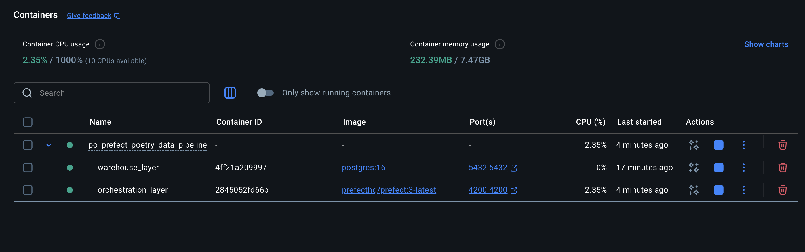

# 🚀 ETL Pipeline Playground — Assessment Edition  
#### Tech stack: Poetry + Prefect + Boto 3 + AWS CLI + S3 + Postgres + Docker VM's + macOS M Series Silicon)
#### Note: Take this project as an onboarding process in your new data engineer role or to surprise a tech interviewer for a job application.

> _“Because nothing says ‘hire me’ like a modular, observable, containerised ETL that refuses to break under pressure.”_

Welcome to your **mini production data platform in a box**, built to showcase the skills required for the ETL assessment:

- Extract structured/unstructured data from **AWS S3**
- Transform & enrich it using **clean, modular Python** prefects new version of Apache Airflow midnset. (runing inside docker)
- Load results into **Postgres** (running inside Docker)
- Wrap everything with **Prefect flows & tasks**  
- Ship the whole thing as **containerised, reproducible infra** to reproduce on the cloud.
- Demonstrate **real-world engineering patterns** in under 2 hours  

This repository is designed to be easy to review during the follow-up session. 

Reviewers can quickly see:

✔ Architecture & data flow  
✔ Modular Python design (tasks, utils, config)  
✔ Orchestration via Prefect flows & tasks  
✔ Docker/Postgres setup  
✔ Your platform-engineering thought process  

---

## 🧠 How to Run This? (Poetry Edition)

Before cloning the repo or diving into the Prefect world, make sure you have:

1. **Homebrew** (recommended on macOS)
2. **Git**
3. **Python 3.12.x**
4. **Docker Desktop** (For VMs config management)
5. **Poetry** (python project VM management)
6. **Prefect** (Orchestration layers)
7. **AWS CLI** (configured with credentials that can read the test S3 bucket and store credentials using AWS KMS)

If you’re on an Apple Silicon (M1/M2/M3/M4) Mac, everything here is tested with that in mind.

---

## ⚙️ 0. Installing Prerequisites (macOS, M-Series Friendly)

If you already have these, you can skip to the next section.

```bash
# Homebrew
/bin/bash -c "$(curl -fsSL https://raw.githubusercontent.com/Homebrew/install/HEAD/install.sh)"

# Python 3.12 (via pyenv or directly, your call)
brew install python@3.12

# Git & Docker
brew install git
brew install --cask docker

# Poetry (official recommended installer)
brew install poetry

# AWS CLI
brew install awscli
aws configure  # (Optional) set up your AWS creds manually

# Prefect (installed in the project venv later via Poetry)
```

Make sure Docker Desktop is up and running before continuing.

## 📦 1. Clone the Repo

```bash
git clone https://github.com/jrengif/po_prefect_poetry_data_pipeline.git
cd po_prefect_poetry_data_pipelines
```


## 🧩 2. Create & Activate the Python Environment

Everything is managed with Poetry.

```bash
poetry env use 3.12

# Install dependencies (including Prefect, SQLAlchemy/psycopg, boto3, etc.)
poetry install

# Activate the virtual environment
eval $(poetry env activate)
```

## 🔐 3. Configuration & Environment Variables

Configuration is driven via environment variables.

You can use a local .env file in the project root; this repo assumes something like:

Take this .env file and update it with the specific data for little Proof of Concept

```bash
# .env

# AWS/S3
AWS_ACCESS_KEY_ID=your_access_key_id
AWS_SECRET_ACCESS_KEY=your_secret_access_key
AWS_DEFAULT_REGION=eu-west-1
S3_INPUT_BUCKET=your-input-bucket
S3_INPUT_PREFIX=data/raw/
S3_OUTPUT_PREFIX=data/processed/

# Postgres (Docker) – master credentials (local dev only!)
POSTGRES_USER=admin
POSTGRES_PASSWORD=admin_password
POSTGRES_DB=warehouse_db
POSTGRES_HOST=localhost
POSTGRES_PORT=5432

# separate ETL user app/flows to connect with more limited permissions.
ETL_DB_USER=etl_user
ETL_DB_PASSWORD=etl_password

```

## 🐳 4. Start VMs architechture with Docker - Orchestration and storaging layer

A simple docker-compose file is included to run Postgres and prefect in a container. From the project root:


```bash
# From the project root (where docker-compose.yml lives), run:
docker compose up -d

# (Optional) If you’ve changed images or Docker-related config and want to rebuild:
docker compose up -d --build
```

After runing that you could check on docker desktop and the the containers running isolated.




Typical docker-compose.yml service for Postgres looks like, trying to follow best practices using .env file:

```bash
services:
  db:
    image: postgres:16
    environment:
      POSTGRES_USER: ${POSTGRES_USER:-etl_user}
      POSTGRES_PASSWORD: ${POSTGRES_PASSWORD:-etl_password}
      POSTGRES_DB: ${POSTGRES_DB:-etl_db}
    ports:
      - "5432:5432"
    healthcheck:
      test: ["CMD-SHELL", "pg_isready -U $$POSTGRES_USER"]
      interval: 5s
      timeout: 5s
      retries: 5
```


You can verify if containers are up:

```bash
docker ps

# For stopping the container you can run
docker compose stop

# For starting again
docker compose start
```

### 🚀 What `docker compose up` Does

When you run `docker compose up`, Docker Compose will:

1. 📄 **Read `docker-compose.yml`**
   - 🔎 Finds your services: `warehouse_layer` and `orchestration layer`.
   - ⚙️ Loads volumes, environment variables, ports, healthchecks, etc.

2. 🌐 **Create the Docker network**
   - 🧩 Places all services on the same internal network.
   - 🔗 This is why `prefect` can reach Postgres using `POSTGRES_HOST=db` (the service name).

3. 🧱 **Create and start the containers**
   - 📥 Pulls the required images (`postgres:16`, `prefecthq/prefect:3-latest`) if you don’t have them locally.
   - 📦 Creates containers:
     - 🗄️ `warehouse_layer` for the PostgreSQL database
     - 🧠 `orchestration_layer` for Prefect
   - 💾 Attaches the named volume `postgres_data` to Postgres for persistent storage.

4. 📡 **Expose ports to your host machine**
   - 🐘 Exposes Postgres on `localhost:${POSTGRES_PORT:-5432}`.
   - 📊 Exposes the Prefect UI on `http://localhost:4200`.

5. 🧾 **(Foreground mode) Stream logs in your terminal**
   - 🖥️ If you omit `-d`, you’ll see logs from both `db` and `prefect` in your terminal.


🧱 5. checking that the prefect env and warehouse layer are up 

For the Prefect part lets open the URL and you could see the APP runing and being accesible from the local host

http://localhost:4200/dashboard


For postgress use DBeaver to acces using admin priviliges as DBM

https://dbeaver.io/download/

After testing on debeaver filling the fields using the ones provided in the .env file


## 📂 Project Structure! Let's do a break!

This repository is structured like a mini production-ready data platform:

```bash
poc_prefect_poetry_data_pipeline/
  infra/postgres/init-etl.user.sh # Script for creating ETL postgres user
  .env
  .gitignore
  docker-compose.yml
  poetry.lock # (added after poetry install )
  pyproject.toml # (poetry project VM managment)
  README.md # Step by step config easy to replicate and learn the concepts
```