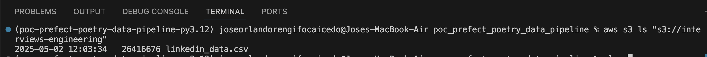
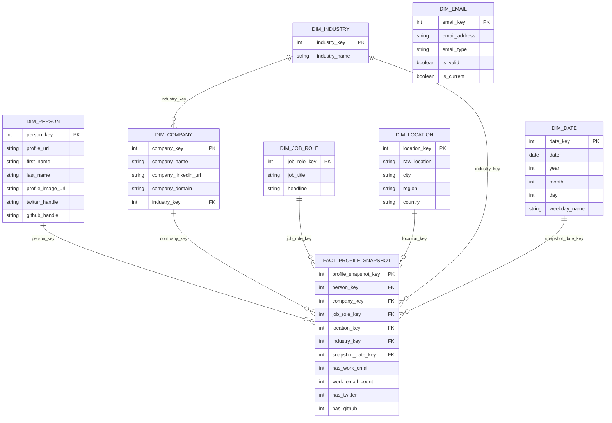

# First undestanding the process

Check what is expected to be done in the Bitbucket provided repo

https://bitbucket.org/leadinfo/interview-data-engineering/src/master/README.md


# 1. Checking how the raw files look
    - Use AWS CLI to acces easily to the file before processing it!
        ```bash
            # Load .env into your shell
            set -a           # automatically export variables
            source .env
            set +a

            # Now AWS CLI will just use them
            aws sts get-caller-identity
            aws s3 ls "s3://$BUCKET"
        ```
    - After checking the bucket you should be able to see the files inside
        
    - Then you can donwload that file and check it using VS_CODE
        ```bash
            aws s3 cp s3://interviews-engineering/linkedin_data.csv ./test/data/linkedin_data.csv
        ```
# 2. Check what possible transformations can be done for the file

How does the data look?
So we are provided with a csv file and that is meant to feed a datawarehouse layer so we can think in a proper data model for that.
So after checking the data we can think of creating a star model schema desing for analytics purposes and simple queries

## 2.0. Choose the grain

Grain of the main fact table:
One row per person–company–role snapshot (i.e., a LinkedIn profile record as loaded on a given date).
That lets you re-load the same profile daily and still track changes (new company, new title, etc).

## 2.1 Facts & Dimension tables
### 1. dim_person

Person-centric attributes that don’t depend on company or role.

Columns:
- person_key (PK, surrogate INT)
- profile_url (natural key, from Url)
- first_name
- last_name
- profile_image_url
- twitter_handle
- github_handle
    - Example from your CSV:
        - profile_url = 'https://www.linkedin.com/in/ebony-rosé-a669a898'

### 2. dim_company

Company-level attributes.

Columns:
- company_key (PK)
- company_name (from Company) 
- company_linkedin_url (from Company LinkedinUrl)
- company_domain (from Company Domain)
- industry_key (FK to dim_industry)

### 3. dim_industry

Normalised industry names.

Columns:
- industry_key (PK)
- industry_name (from Industry, e.g. “Military”, “Information Technology & Services”)

### 4. dim_job_role

Attributes about the person’s role/position.

Columns:
- job_role_key (PK)
- job_title (from Job Title, e.g. “imagery analyst”, “Team leader”)
headline (from Headline, e.g. “imagery analyst at United States Army”)

### 5. dim_location

Parsed or raw location.

Columns:
- location_key (PK)
- raw_location (from Location, e.g. “Fort Stewart, Georgia”)
- city
- region
- country
    - (You can start with just raw_location and enrich later.)

### 6. dim_email

To keep multiple emails normalized and re-usable.

Columns:
- email_key (PK)
- email_address
- email_type (e.g. WORK_PRIMARY, WORK_OTHER)
- is_valid (optional)
- is_current (optional)

### 7. dim_date

Standard calendar dimension, used for snapshot/load dates and any future time measures.

Columns:
- date_key (PK, e.g. 20251119)
- date
- year
- month
- day
- weekday_name


### 8. fact_profile_snapshot

Grain: one row per person–company–role snapshot per load date.

Columns:
- profile_snapshot_key (PK)
- person_key (FK → dim_person)
- company_key (FK → dim_company)
- job_role_key (FK → dim_job_role)
- location_key (FK → dim_location)
- industry_key (FK → dim_industry)
- snapshot_date_key (FK → dim_date)

Degenerate / small measures:
- has_work_email (0/1)
- work_email_count (number of work emails found)
- has_twitter (0/1)
- has_github (0/1)

This table doesn’t store emails directly—only flags/counts. Emails live in a separate bridging fact.

## 2.2 Check Data model diagram

Note: Pre install mermaid extendion on VScode



# task for handling user with multiple email accounts


3. Pre build the datawarehouse model before ingesting

Now we can create a python script build this model in advance in order to don't deal with that when prefect flow is pushing the dat into the warehouse_layer

- Check the pre-build python file on the infra/postgres/init-start-schema.py
- This file is gonna be executed on while the docker compose build is executed

Check in DBeaver that the script actually created the empty tables and relationships

# Lets code! Get hands dirty!


